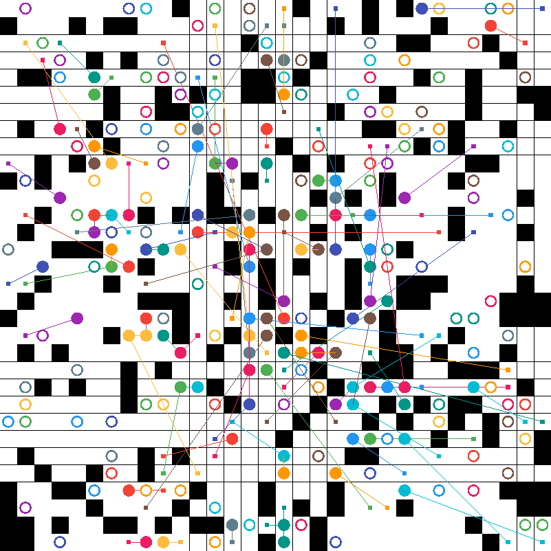
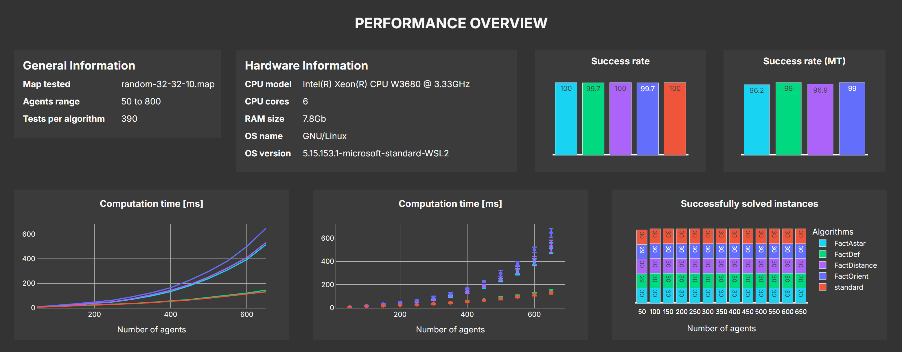

LaCAM2_fact
---
[](LICENSE)
[](https://github.com/Kei18/lacam2/actions/workflows/ci.yml)

This is a factorized version of the LaCAM2 algorithm from Keisuke Okumura.

Do you want the power?
LaCAM* could be the answer.

The original work is from code repository of the paper ["Improving LaCAM for Scalable Eventually Optimal Multi-Agent Pathfinding"](https://kei18.github.io/lacam2/) (IJCAI-23), extended from from [the LaCAM repo](https://kei18.github.io/lacam/) presented at AAAI-23.

## Building

To build the project you need is [CMake](https://cmake.org/) (≥v3.16). The code is written in C++(17).

First, clone this repo with submodules.

```bash
git clone https://github.com/idsc-frazzoli/LaCAM2_fact.git
```

Depending on the configuration of your environnement, you might also need other linux libraries such as qt-5-default. To install the required packages, run the following command.

```bash
sudo apt-get install qtbase5-dev qtchooser qt5-qmake qtbase5-dev-tools
```

Then dowload the required submodules. This project uses two submodules: [argparse](https://github.com/p-ranav/argparse) by P-Ranav and [easy_profiler](https://github.com/yse/easy_profiler) by yse.

```bash
cd LaCAM2_fact
git submodules init
git submodules update
```

Finally, you can build the project.

```bash
cmake -B build && make -C build -j4
```


## Usage

Basic run with 50 agents on the 'random-32-32-20' map. The important arguments are :
-i : the path to the .scen file specifying the start and goal location for every agent.
-m : the path to the .map file of the given problem.
-N : the number of agents.
-v : the verbosity level. for -v 0,  the code will not provide any output to the terminal.

Try running the following command :

```bash
> build/main -i assets/maps/random-32-32-20/other_scenes/random-32-32-20-700.scen -m assets/maps/random-32-32-20/random-32-32-20.map -N 10 -v 1
solved: 1ms     makespan: 47 (lb=47, ub=1)      sum_of_costs: 1297 (lb=1098, ub=1.19)   sum_of_loss: 1198 (lb=1098, ub=1.1)
```

There are other arguments you can specify in order to use all the feature of LaCAM2_fact :

- `-mt` (or `--multi_threading`): This argument toggles whether the program uses multiple cores to solve MAPF instances in parallel (if applicable). By defauly it is set to false. use `-mt` or `-mt yes` to enable multi threading.

- `-f` (or `--factorize`): This argument specifies the mode of factorization to be used in the solving process. The options are standard, FactDistance, FactBbox, Factorient, FactAstar, or FactDef, with the default being standard. This determines how the algorithm factorizes the problem for more efficient solving.

- `-s` (or `--save_stats`): This argument toggles whether the program should save statistics about the run. The satistics are saved in the `stats.json` file. By default, it is set to true. Use `-s false` to disable saving statistics.

- `-sp` (or `--save_partitions`): This argument controls whether the program saves the partitions generated during the solving process. By default, it is set to false. Use `-sp` to enable saving partitions.


You can find details of all parameters with:
```bash
build/main --help
```

Note that some parameters are only compatible with the standard version and some others only with the factorized verison of LaCAM2.

## Visualizer

This repository is compatible with [@Kei18/mapf-visualizer](https://github.com/kei18/mapf-visualizer).

<div style="text-align: center;">
  
  <div>Example with 200 agents in random-32-32-20.map</div>
</div>

## Data visualization

Once you ran a couple tests, you can visualize the .json files using a dedicated dashboard in the `assets` folder. To use this script, run it from the command line with the required and optional arguments.The `--map_name` argument is mandatory and specifies the name of the map to display. Optionally, you can provide the `--read_from` argument to specify a file to read data from , and the `--theme argument` to set the application theme to either 'dark' or 'light' (default is 'dark').

```bash
python3 assets/dashboard.py --map_name random-32-32-10 --read_from stats.json --theme dark
```

The dashboard contains a lot of interesting data, starting with simple general information about the tests (what map, how many agents, how many tests). Then some information about the current hardware of the machine (careful, this data does not represent the hardware used to generate a given .json file). 

The two graphs on the top right represent the succes rate of the different algorithms in %. The first row of charts is for sequential solving of MAPF instances and the second row is about the multi-threaded solving (MT). The solving times are averaged out and plotted as a function of the agent number in the map. Information about the variance can be viewed in the center charts. The charts on the far right depict the successfully solved instances as a function of agent number.

The fourth row shows data about average CPU and maximum RAM usage during the solving.

<div style="text-align: center;">
  
  <div>Screenshot of the dashboard.</div>
</div>


## Documentation

The [docs](docs) folder contains the documentation of this project. Simply open the [index](docs/html/index.html) and navigate through the docs. 


## Code Profiling

You can take advantage of the [Easy Profiler library](https://github.com/yse/easy_profiler) in order to analyze the code and dive into the internals of the algorithms.

To use the profiling, the variable ENABLE_PROFILING needs to be defined. Be aware that toggling the profiler may affect performances.

To toggle the profiling mode, you need to build the project accordingly by setting ENABLE_PROFILING=ON.

```bash
cmake -D ENABLE_PROFILING=ON -B build && make -C build -j4
```

Changing the definition of ENABLE_PROFILING, requires you to rebuild the project. 
At every run, the collected data will be stored in 'code_profiling/profile.prof'.

This file can then be vizualised by using the Easy Profiler Visualizer. There should be an executable called 'profiler_gui' in the build directory of the Easy Profiler. You can use this to visualize everything in detail.

```bash
./build/third_party/easy_profiler/bin/profiler_gui
```

Once you opened the visualizer, you can use the folder icon at the top left to open the 'profile.prof' file.

To stop profiling, clean build the project again using the instructions in the 'Building' section.


## Notes

- The grid maps and scenarios in `assets/maps/` are from [MAPF benchmarks](https://movingai.com/benchmarks/mapf.html).
- `tests/` is not comprehensive. It was used in early developments.
- Auto formatting (clang-format) when committing:

```bash
git config core.hooksPath .githooks && chmod a+x .githooks/pre-commit
```

LaCAM* variants are available in [tags](https://github.com/Kei18/lacam2/tags).


## Licence

This software is released under the MIT License, see [LICENSE.txt](LICENCE.txt).
